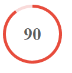

# responsive-svg-circlebar

With this **small script** it's very easy to generate your own **fully responsive Circlebar** by using the new HTML5 technic **SVG**.

## Brief Demo

## Who to use it
At first you have to include the following includes to your html file:

    
	

First we include the latest jQuery source. If you want you can use your own jQuery file by just editing the first line.
In the second line we include the script for the **circle bar**.

Now you have successful included this awesome script!

The only step which is missing right now is to include the SVG source to the position where the circle bar should be in your page by just inserting:

    <svg viewBox="0 0 200 200" preserveAspectRatio="none" data-progress="90" class="bar">
		<circle cx="100" cy="100" r="100" fill="#F9DBDA"/>
		<path id="ring" fill="#e74c3c"/>
		<circle cx="100" cy="100" r="<-progress value->" fill="#ffffff"/>
		<text x="100" y="100" text-anchor="middle" dominant-baseline="central" fill="#5c5c5c" font-size="60" font-weight="bold"><-progress value-></text>
	</svg>
at the right place. 
To customize your value you just have to insert your number instead of the <-progress value-> in the code. The value must be in the following **interval: [0; 100]**